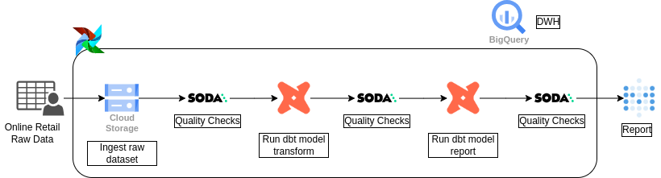
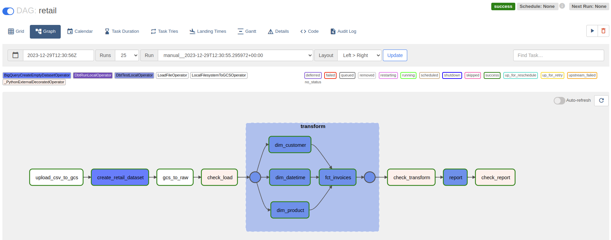
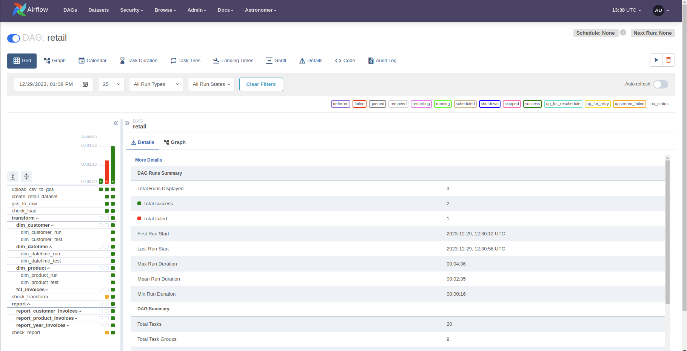
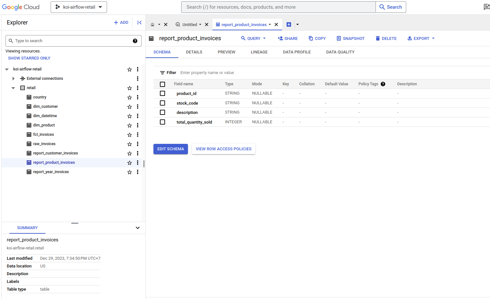
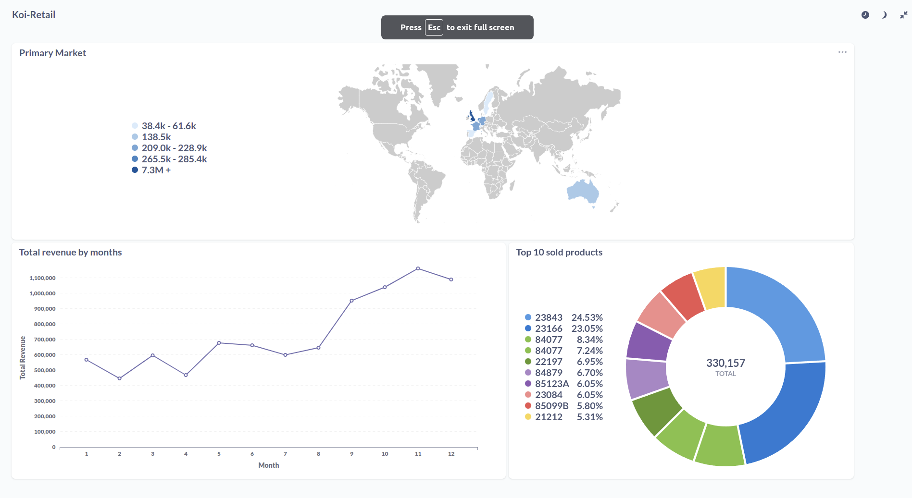

# Retail Data Pipeline

This project is a data pipeline for retail data. It includes ETL processes, data analysis, and reporting features.

## Tech stacks  

- [Docker](https://docs.docker.com/engine/install/)
- [Astro CLI](https://docs.astronomer.io/astro/cli/overview)
- [Soda](https://www.soda.io/)
- [GCP account](https://cloud.google.com/?hl=en)
- [DBT](https://docs.getdbt.com/docs/introduction)

## Data source  

[Online retail dataset](https://www.kaggle.com/datasets/tunguz/online-retail)

| Column | Description |
| --- | --- |
| InvoiceNo | Product (item) code. Nominal, a 5-digit integral number uniquely assigned to each distinct product. |
| StockCode | Product (item) code. Nominal, a 5-digit integral number uniquely assigned to each distinct product. |
| Description | Product (item) name. Nominal. |
| Quantity | The quantities of each product (item) per transaction. Numeric. |
| InvoiceDate | Invoice Date and time. Numeric, the day and time when each transaction was generated. |
| UnitPrice | Unit price. Numeric, Product price per unit in sterling. |
| CustomerID | Customer number. Nominal, a 5-digit integral number uniquely assigned to each customer. |
| Country | Country name. Nominal, the name of the country where each customer resides. |

## Airflow UI  

Graph view

## Result  

Airflow run

Bigquery DWH

Metabase Dashboard

## License  

This project uses the following license: [GNU General Public License v2.0](./LICENSE).  

## Usage note  

[More notes](./notes/usage_note.md)  
